# Deploying-A-MERN-Stack-Todo-Application

A **MERN** stack consists of a collection of technologies used for the development of web applications. It comprises of MongoDB, Express, React and Node which are all JavaScript technologies used for creating full-stack applications and dynamic websites.

**MongoDB**: is a document-oriented NoSQL database technology used in storing data in the form of documents.

**React**: a javascript library used for building interactive user interface based on components.

**Express**: its a web application framework of Node js which is used for building server-side part of an appication and also creating Restful APIs.

**Node**: Node.js is an open-source, cross-platform runtime environment for building fast and scalable server-side and networking applications.

We will be building a simple todo list application and deploying on AWS cloud EC2 machine.

### Creating EC2 Instances

We log on to AWS Cloud Services and create an EC2 Ubuntu VM instance. When creating an instance, choose keypair authentication and download private key(*.pem) on your local computer.


On windows terminal, cd into the directory containing the downloaded private key.Run the below command to log into the instance via ssh:

ssh -i <private_keyfile.pem> username@ip-address

### Configuring Backend

Run `sudo apt` update and `sudo apt upgrade` to update all default ubuntu dependencies to ensure compatibility during package installation.


Next up will be to install nodejs, first we get the location of nodejs form the ubuntu repository using the following command. 
```
curl -sL https://deb.nodesource.com/setup_12.x | sudo -E bash -
```
Then we run a node install
```
sudo apt-get install -y nodejs
```


### Setting up the application

We then create a directory that will house our codes and packages and all subdirectories to represent components of our application.
```
mkdir todo
```
Inside this directory we will instantiate our project using `npm init`. This enables javascript to install packages useful for spinning up our application.


### Express installation

We will be installing express which is nodejs framework and will be helpful when creating routes for our application via HTTP requests.
```
npm install express
```


Create an `index.js` file which will contain code useful for spinning up our express server

Install the `dotenv` module which is a module that loads environment variables from a `.env` file into `process.env`. The `.env` files are useful for hiding important credentials which shouldnt be exposed.
```
npm install dotenv.
```
open the  `index.js` file with vi 
```
 vi index.js
 ```

 We copy the folowing code into it and "save" using ":wq"
```
const express = require('express');
require('dotenv').config();

const app = express();

const port = process.env.PORT || 5000;

app.use((req, res, next) => {
res.header("Access-Control-Allow-Origin", "\*");
res.header("Access-Control-Allow-Headers", "Origin, X-Requested-With, Content-Type, Accept");
next();
});

app.use((req, res, next) => {
res.send('Welcome to Express');
});

app.listen(port, () => {
console.log(`Server running on port ${port}`)
});
```

We start our server to see if it works. Before we start the server, we need to be sure we are in the Todo directory.
Run `node index.js` to spin up our server.

This code is useful for spinning up our application via the port specified in the code.

Allow our port as part of the inbound security rules in our EC2 instance to ensure that our server is visible via the internet.


Paste our public ip address on the browser with the port to see if the server is properly configured.


### Defining Routes For our Application

We will create a `routes` folder which will contain code pointing to the three main endpoints used in a todo application. This will contain the post,get and delete requests which will be helpful in interacting with our client_side and database via restful apis.
```
mkdir routes
cd routes
touch api.js
```
Write the The below code in api.js. It is an example of a simple route that fires various endpoints.
```
const express = require ('express');
const router = express.Router();

router.get('/todos', (req, res, next) => {

});

router.post('/todos', (req, res, next) => {

});

router.delete('/todos/:id', (req, res, next) => {

})

module.exports = router;
```

### Creating models

We then go ahead to create **"Models"** since the application will be using **MongoDB** which is a noSQL database. A **Model** makes the javascript application interactive. We also use Models to define the **database schema** . This is important so that we will be able to define the fields stored in each Mongodb document.

The **Schema** shows how the database will be setup, including other data fields that may not be required to be stored in the database.

To create a `Schema` and a `model`, we will need to install **mongoose** which is a **Node.js** package that makes working with mongodb easier.

To install Mongoose, we make sure we are in the Todo directory then run the command:
```
npm install mongoose
```

after that we go ahead to create a folder models by running the command:
```
mkdir models
```
Then we chaneg into the model directory:
```
cd models
```
Inside the models folder, create a file named todo.js
```
touch todo.js
```
We then open the todo.js file and paste the following codes:
```
const mongoose = require('mongoose');
const Schema = mongoose.Schema;

//create schema for todo
const TodoSchema = new Schema({
action: {
type: String,
required: [true, 'The todo text field is required']
}
})

//create model for todo
const Todo = mongoose.model('todo', TodoSchema);

module.exports = Todo;
```


Since we have defined a schema for how our database should be structured, we then update the code in our api.js to fire specific actions when an endpoint is called.
```
cd routes
```
Open the api.js file
```
vim api.js
```

We copy and paste the following codes into the file:
```
const express = require ('express');
const router = express.Router();
const Todo = require('../models/todo');

router.get('/todos', (req, res, next) => {

//this will return all the data, exposing only the id and action field to the client
Todo.find({}, 'action')
.then(data => res.json(data))
.catch(next)
});

router.post('/todos', (req, res, next) => {
if(req.body.action){
Todo.create(req.body)
.then(data => res.json(data))
.catch(next)
}else {
res.json({
error: "The input field is empty"
})
}
});

router.delete('/todos/:id', (req, res, next) => {
Todo.findOneAndDelete({"_id": req.params.id})
.then(data => res.json(data))
.catch(next)
})

module.exports = router;
```

### Creating a MongoDB Database

We use MongoDB Database to store our data using mLab which provides Database as a service (DBaas) solution.

To continue, we sign up [here](https://account.mongodb.com/account/register?signedOut=true).

Follow the sign up process, select AWS as the cloud provider, and choose a region near you.


Go to **"Network access"**, select **"Allow access from anywhere"**. This is not secure but good for testing purposes.


Then change the time of deleting the entry from 6 Hours to 1 Week.


Create a `MongoDB database` and collection inside mLab by clicking on `database`, click on `cluster0` and then open `collections`.


To get the connection string, we click on `cluster0` then click on `connect`


Then we click on `Mongodb drivers` ...connect your application..."


We then copy then connection string displayed into the .env file.


In the `index.js` file, we specified `process.env` to access environment variables, but we are yet to create this file.

To create the process.env file, we creta a file in Todo directory and name it .env.
```
touch .env
```
Open the file
```
vim .env
```
Add the connection string to access the database in it, just as below:
```
DB = 'mongodb+srv://<username>:<password>@<network-address>/<dbname>?retryWrites=true&w=majority'
```
Make sure to update "<username, <password, <network-address" and <database according to your setup.


We need to update the `index.js` to reflect the use of `.env` so that Node.js can connect to the database.

To do that we open the `index.js` file and delete the content using "esc" then ":%d" then "enter".

We then replace then content with the following codes:
```
const express = require('express');
const bodyParser = require('body-parser');
const mongoose = require('mongoose');
const routes = require('./routes/api');
const path = require('path');
require('dotenv').config();

const app = express();

const port = process.env.PORT || 5000;

//connect to the database
mongoose.connect(process.env.DB, { useNewUrlParser: true, useUnifiedTopology: true })
.then(() => console.log(`Database connected successfully`))
.catch(err => console.log(err));

//since mongoose promise is depreciated, we overide it with node's promise
mongoose.Promise = global.Promise;

app.use((req, res, next) => {
res.header("Access-Control-Allow-Origin", "\*");
res.header("Access-Control-Allow-Headers", "Origin, X-Requested-With, Content-Type, Accept");
next();
});

app.use(bodyParser.json());

app.use('/api', routes);

app.use((err, req, res, next) => {
console.log(err);
next();
});

app.listen(port, () => {
console.log(`Server running on port ${port}`)
});
```
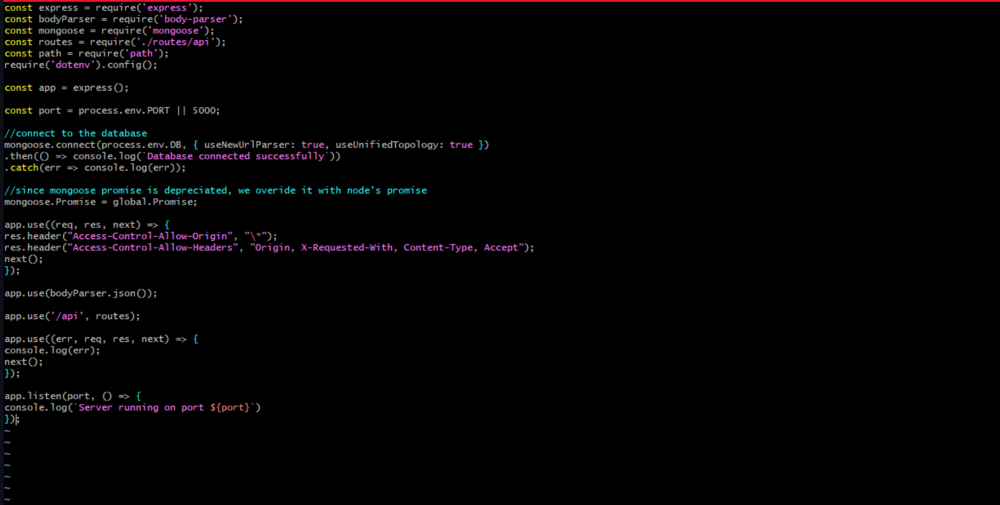

It is more secure to use environment variables to store information so as to separate configuration and secret data from the application, instead of writing connection strings directly inside the index.js application file.

We start our server by running the command:
```
node index.js
```
If the setup has no errors, we should see **"Database connected successfully"**.

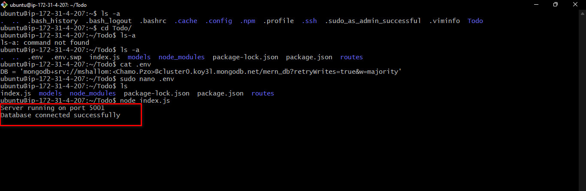

### Testing Backend Code Using Postman

We now have our backend configured, but we need to test it.

To test the backend without the frontend we are going to be using `Restful API` with the help of an `API` development client `Postman`.

To download and install Postman, click [here](https://www.postman.com/downloads/).

Click [here](https://www.youtube.com/watch?v=FjgYtQK_zLE) to learn how to perform [CRUD Operations](https://en.wikipedia.org/wiki/Create,_read,_update_and_delete) on Postman.

We test all the API endpoints and make sure they are working. For the endpoints that require body, you should send JSON back with the necessary fields since it’s what we setup in our code.

Now open your Postman, create a POST request to the API

http://<PublicIP>:5001/api/todos.

This request sends a new task to our To-Do list so the application could store it in the database.

Make sure to set the header "content-type" and "application/json":

On Postman, we make a POST request to our database whilst specifying an action in the body of the request.

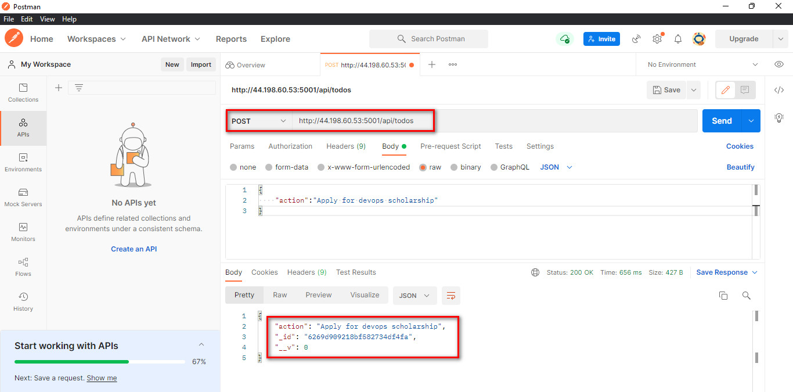

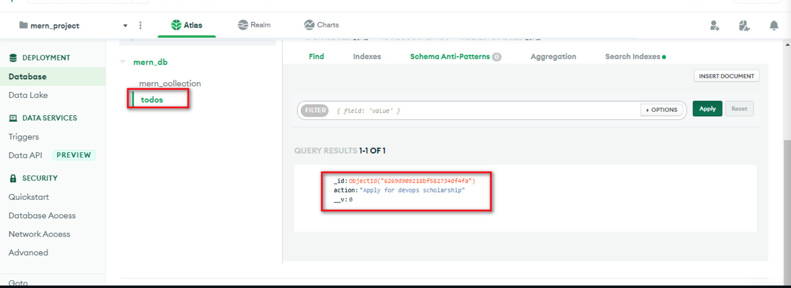

Then We make a GET request to see if we can get back what has been posted into the database.

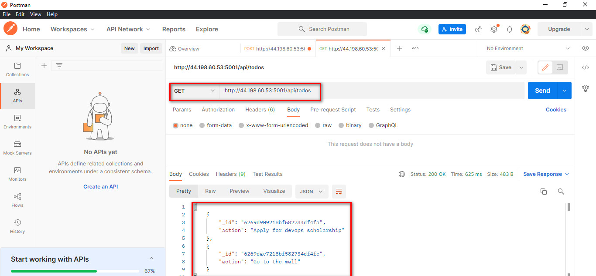

We can also make a delete request which deletes and entry using the id of each entry.

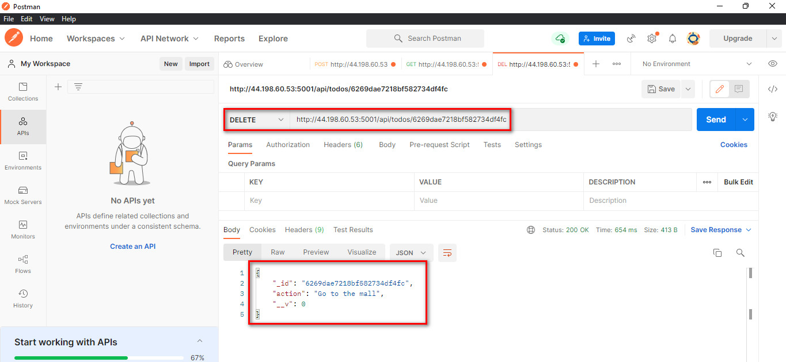

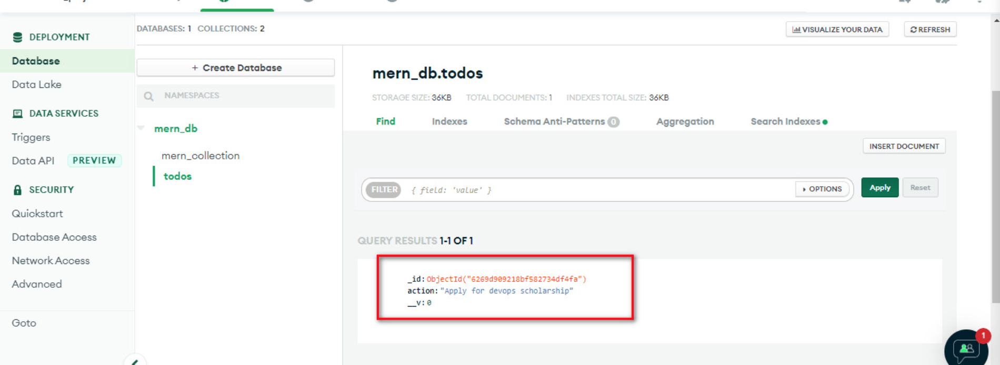


# Creating Frontend

In the todo directory which is same directory containing the backend code.
Run 
```
npx create-react-app client 
```
This creates a client directory containing the necessary packages required for react to work.

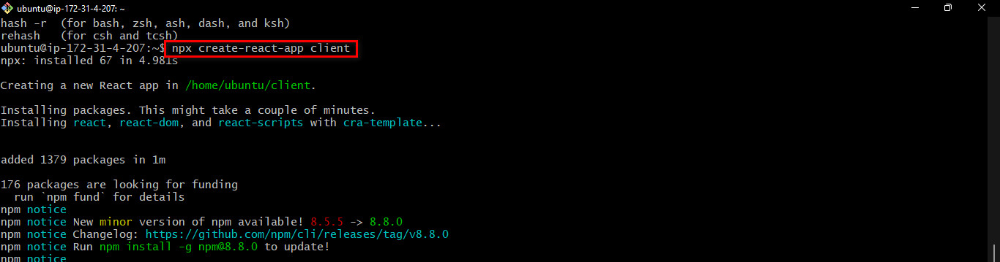

We then install `concurrently` and `nodemon` which are important packages used for the build up process. `Concurrently` ensures that multiple commands can be run at the same time on the same terminal.
```
npm install concurrently --save-dev
npm install nodemon --save-dev
```
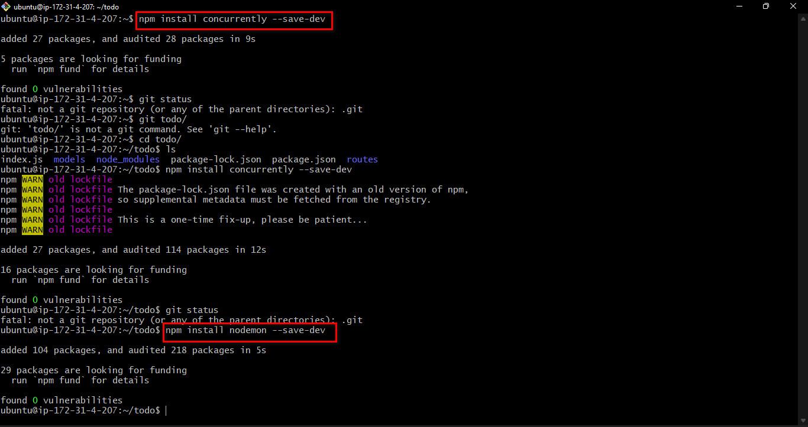

### We configure package.json to run the new installation
Goto the *Todo* directory, open the `package.json` file.
In this file, replace the **"scripts"** section with the following code:
```
"scripts": {
"start": "node index.js",
"start-watch": "nodemon index.js",
"dev": "concurrently \"npm run start-watch\" \"cd client && npm start\""
},
```
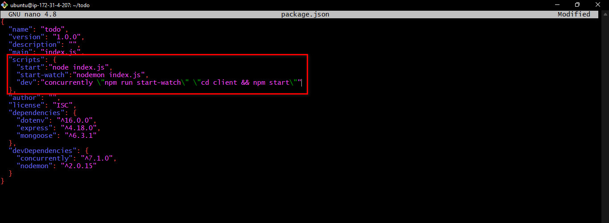


Configured proxy in package.json to ensure we access our site via using `http://localhost:5000` rather than always including the entire path like `http://localhost:5000/api/todos`.

Change into the client directory:
```
cd client
```
Open package.json file:
```
vim apckage.json
```
Add the key value pair in the package.json file
```
"proxy": "http://localhost:5000"
```
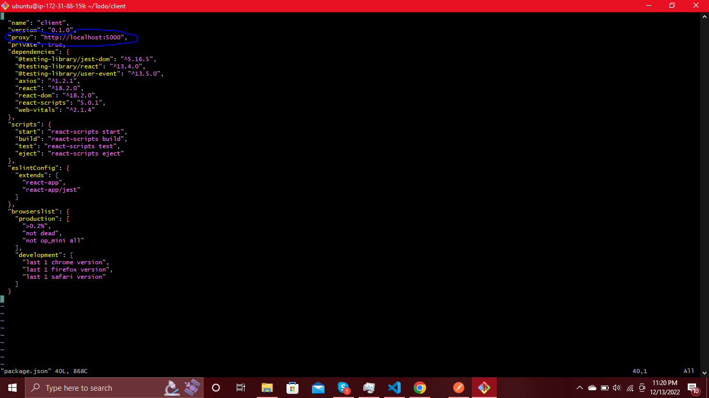

We go back to the Todo directory:
```
cd ..
```
Then run the command:
```
npm run dev
```
The app should open and start running on localhost:3000.

In order to be able to access the application from the Internet you have to open **TCP port 3000** on EC2 by adding a new Security Group rule. The same way the security group for TCP port **5000** was created. This is done by clicking edit inbound rules.

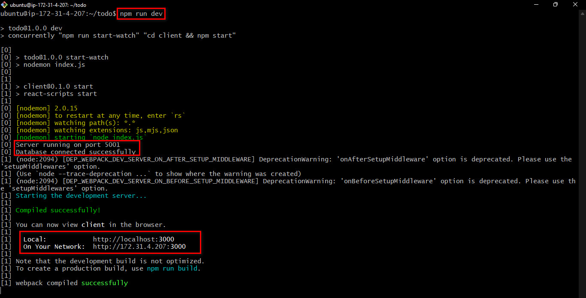

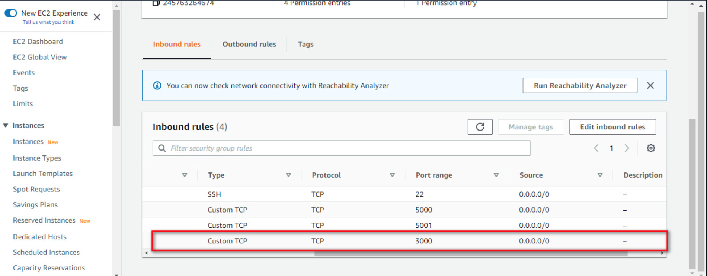

**Creating your React Components**

One of the advantages of react is that it makes use of components, which are reusable and also makes code modular.

Our Todo app will have two stateful components and one stateless component.

Go to Todo directory run the command:
```
cd client
```
Change into the src directory
```
cd src
```
Inside your src folder create another folder called components
```
mkdir components
```
Move into the components directory:
```
cd components
```
Inside components directory create three files Input.js, ListTodo.js and Todo.js.
```
touch Input.js ListTodo.js Todo.js
```
This creates the three files at the same time.

Open Input.js file
```
vi Input.js
```
Copy and paste the following:
```
import React, { Component } from 'react';
import axios from 'axios';

class Input extends Component {

state = {
action: ""
}

addTodo = () => {
const task = {action: this.state.action}

    if(task.action && task.action.length > 0){
      axios.post('/api/todos', task)
        .then(res => {
          if(res.data){
            this.props.getTodos();
            this.setState({action: ""})
          }
        })
        .catch(err => console.log(err))
    }else {
      console.log('input field required')
    }

}

handleChange = (e) => {
this.setState({
action: e.target.value
})
}

render() {
let { action } = this.state;
return (
<div>
<input type="text" onChange={this.handleChange} value={action} />
<button onClick={this.addTodo}>add todo</button>
</div>
)
}
}

export default Input
```
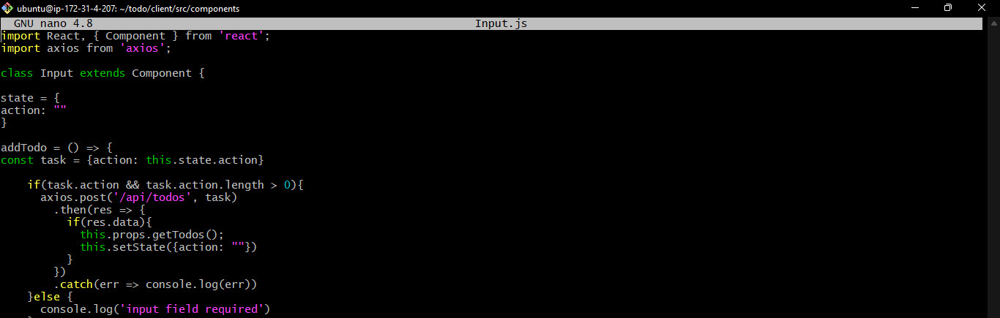

To make use of `Axios`, which is a Promise based HTTP client for the browser and node.js.

We go into the client directory and run the command:
```
cd ../..
```
Then run the command:
```
npm install axios
```

We go to ‘components directory:
```
cd src/components
```
After that we open the ListTodo.js
```
vim ListTodo.js
```
In the ListTodo.js copy and paste the following codes:
```
import React from 'react';

const ListTodo = ({ todos, deleteTodo }) => {

return (
<ul>
{
todos &&
todos.length > 0 ?
(
todos.map(todo => {
return (
<li key={todo._id} onClick={() => deleteTodo(todo._id)}>{todo.action}</li>
)
})
)
:
(
<li>No todo(s) left</li>
)
}
</ul>
)
}

export default ListTodo
```

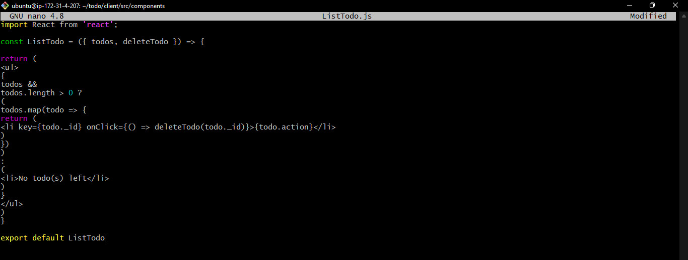

Open the `Todo.js` file we copy and paste the following code:
```
import React, {Component} from 'react';
import axios from 'axios';

import Input from './Input';
import ListTodo from './ListTodo';

class Todo extends Component {

state = {
todos: []
}

componentDidMount(){
this.getTodos();
}

getTodos = () => {
axios.get('/api/todos')
.then(res => {
if(res.data){
this.setState({
todos: res.data
})
}
})
.catch(err => console.log(err))
}

deleteTodo = (id) => {

    axios.delete(`/api/todos/${id}`)
      .then(res => {
        if(res.data){
          this.getTodos()
        }
      })
      .catch(err => console.log(err))

}

render() {
let { todos } = this.state;

    return(
      <div>
        <h1>My Todo(s)</h1>
        <Input getTodos={this.getTodos}/>
        <ListTodo todos={todos} deleteTodo={this.deleteTodo}/>
      </div>
    )

}
}

export default Todo;
```
We then move into the src directory:
```
cd ..
```
Open App.js file:
```
vim App.js
```
Copy and paste the following codes into the file:
```
import React from 'react';

import Todo from './components/Todo';
import './App.css';

const App = () => {
return (
<div className="App">
<Todo />
</div>
);
}

export default App;
```

We Exit.

Next we create the App.css file in the src directory and paste the following codes:
```
.App {
text-align: center;
font-size: calc(10px + 2vmin);
width: 60%;
margin-left: auto;
margin-right: auto;
}

input {
height: 40px;
width: 50%;
border: none;
border-bottom: 2px #101113 solid;
background: none;
font-size: 1.5rem;
color: #787a80;
}

input:focus {
outline: none;
}

button {
width: 25%;
height: 45px;
border: none;
margin-left: 10px;
font-size: 25px;
background: #101113;
border-radius: 5px;
color: #787a80;
cursor: pointer;
}

button:focus {
outline: none;
}

ul {
list-style: none;
text-align: left;
padding: 15px;
background: #171a1f;
border-radius: 5px;
}

li {
padding: 15px;
font-size: 1.5rem;
margin-bottom: 15px;
background: #282c34;
border-radius: 5px;
overflow-wrap: break-word;
cursor: pointer;
}

@media only screen and (min-width: 300px) {
.App {
width: 80%;
}

input {
width: 100%
}

button {
width: 100%;
margin-top: 15px;
margin-left: 0;
}
}

@media only screen and (min-width: 640px) {
.App {
width: 60%;
}

input {
width: 50%;
}

button {
width: 30%;
margin-left: 10px;
margin-top: 0;
}
}
```

we Exit

Still in the same src directory, we create and open the index.css file:
```
touch index.css
```
```
vi index.css
```
We then copy and paste the following codes:
```
body {
margin: 0;
padding: 0;
font-family: -apple-system, BlinkMacSystemFont, "Segoe UI", "Roboto", "Oxygen",
"Ubuntu", "Cantarell", "Fira Sans", "Droid Sans", "Helvetica Neue",
sans-serif;
-webkit-font-smoothing: antialiased;
-moz-osx-font-smoothing: grayscale;
box-sizing: border-box;
background-color: #282c34;
color: #787a80;
}

code {
font-family: source-code-pro, Menlo, Monaco, Consolas, "Courier New",
monospace;
}
```

We go to the Todo directory:
```
cd ../..
```
In the Todo directory, we then run the command:
```
npm run dev
```
If there are no errors, there should be a message "webfiles compiled successfully".

To view this on the browser, we past the URL:

`http://<PublicIP>:3000`

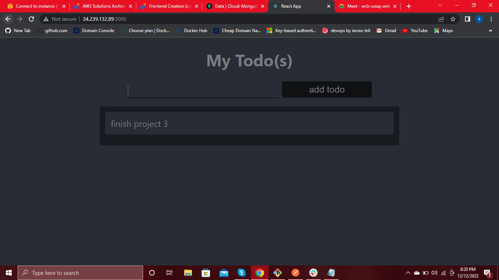
