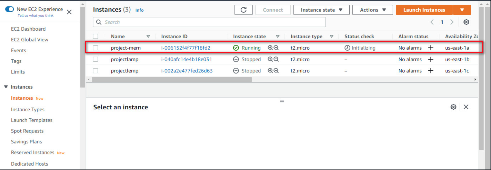

# Deploying-A-MERN-Stack-Todo-Application

A **MERN** stack consists of a collection of technologies used for the development of web applications. It comprises of MongoDB, Express, React and Node which are all JavaScript technologies used for creating full-stack applications and dynamic websites.

**MongoDB**: is a document-oriented NoSQL database technology used in storing data in the form of documents.

**React**: a javascript library used for building interactive user interface based on components.

**Express**: its a web application framework of Node js which is used for building server-side part of an appication and also creating Restful APIs.

**Node**: Node.js is an open-source, cross-platform runtime environment for building fast and scalable server-side and networking applications.

We will be building a simple todo list application and deploying on AWS cloud EC2 machine.

### Creating EC2 Instances

We log on to AWS Cloud Services and create an EC2 Ubuntu VM instance. When creating an instance, choose keypair authentication and download private key(*.pem) on your local computer.

On windows terminal, cd into the directory containing the downloaded private key.Run the below command to log into the instance via ssh:

ssh -i <private_keyfile.pem> username@ip-address
